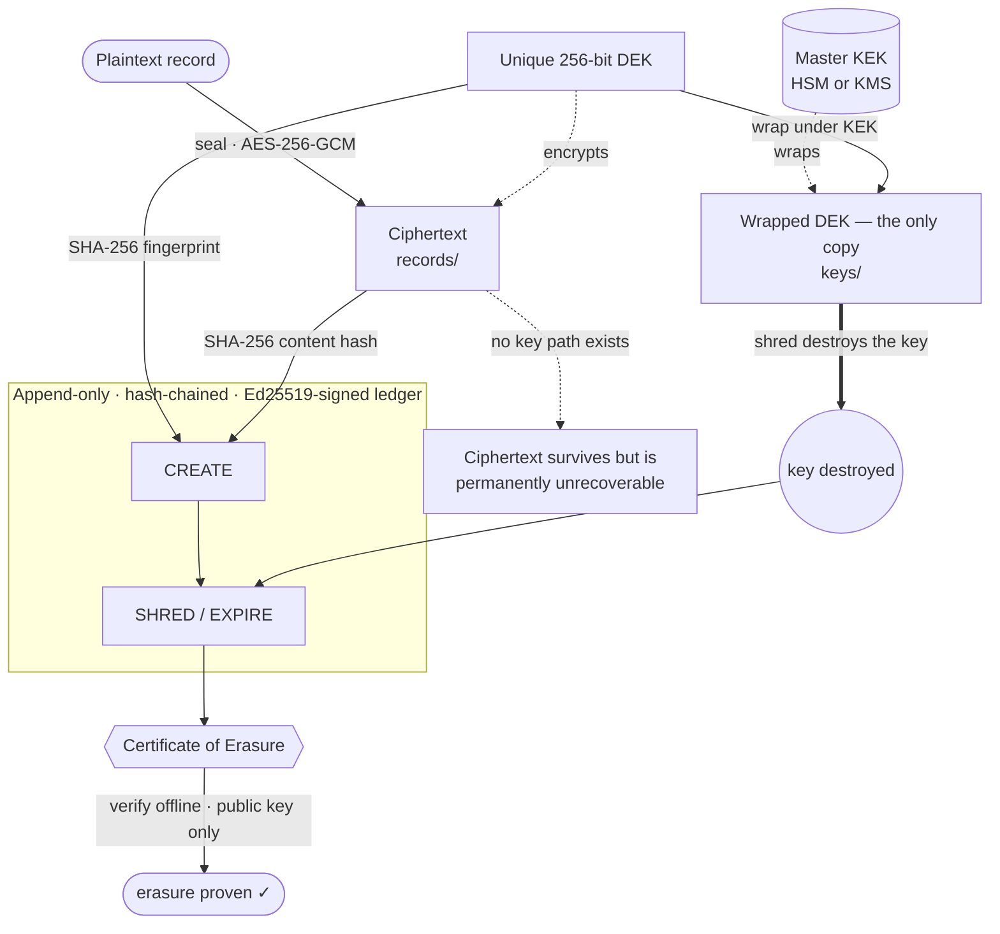

# Crypto-Shredding + Proof-of-Deletion Engine

[](https://github.com/Paqads/crypto-shred-engine/actions/workflows/ci.yml)
[](LICENSE)


> Encrypt every record under its own key. To **delete** data, destroy the key — the
> ciphertext becomes permanently unrecoverable. Because the key is gone, you can
> **prove** deletion instead of merely asserting it.

"We ran a `DELETE` statement, trust us" is not proof. This engine turns erasure
into a cryptographic fact: a signed, tamper-evident, **independently verifiable
Certificate of Erasure** that a regulator or auditor can check offline with
nothing but a public key.

It directly extends AES-256-GCM encryption and pairs with retention rules, so
data can **cryptographically expire itself** the moment its lawful retention
period ends.

---

## Tech stack

| Layer | Choice | Rationale |
|-------|--------|-----------|
| **Runtime** | Node.js ≥ 23.6 with **native TypeScript** | Runs `.ts` directly via type-stripping — no build step, full types |
| **Encryption** | **AES-256-GCM** (`node:crypto`) | Authenticated encryption (confidentiality + integrity) |
| **Key hierarchy** | **Envelope encryption** — a KEK wraps per-record DEKs | The AWS KMS / Google Tink model |
| **Proof ledger** | Hash-chained log + **Ed25519** signatures | Tamper-evident, non-repudiable, offline-verifiable |
| **Commitments** | **SHA-256** key fingerprints | Prove *which* key existed without revealing it |
| **Storage** | Plain JSON / JSONL files | Fully inspectable — watch the key vanish on shred |
| **Tests** | `node --test` (built-in) | — |
| **Dependencies** | **None** | Smaller attack surface is a feature, not an accident |

Zero third-party code touches key material. `package.json` has an empty
`dependencies` block on purpose.

---

## Quick start

```bash
# No install step — Node 23.6+ runs the TypeScript directly.
node --test          # run the test suite (13 tests)
node demo/demo.ts    # watch the full narrated walkthrough
```

### CLI

```bash
S=bin/cli.ts

node $S init --issuer "Acme Health"
node $S put '{"ssn":"123-45-6789"}' --id patient-42   # encrypt + store
node $S get patient-42                                  # decrypt + print
node $S shred patient-42 --reason "GDPR Art. 17 request"
node $S get patient-42                                  # ✗ permanently unrecoverable
node $S prove patient-42 --out cert.json                # issue Certificate of Erasure
node $S verify-cert cert.json                           # ✓ VALID — verified offline
node $S verify-ledger                                   # ✓ chain intact and signed
```

### Library

```ts
import { CryptoShredEngine } from './src/engine.ts';

const engine = CryptoShredEngine.init('./.cryptostore', { issuer: 'Acme Health' });

const rec = engine.put('sensitive payload', { id: 'rec-1' });
engine.get('rec-1');                       // → Buffer('sensitive payload')

engine.shred('rec-1', 'erasure request');  // destroy the key
engine.get('rec-1');                        // throws ShreddedError

const cert = engine.proveDeletion('rec-1');
CryptoShredEngine.verifyCertificate(cert); // → { valid: true, checks: {...} }
```

---

## Architecture



**Two moves.** *Store:* each record is sealed under its own DEK; the DEK is wrapped
under the KEK and that wrapped blob is the only copy of the key; the key fingerprint
and ciphertext hash are committed to the signed ledger. *Erase & prove:* destroying
the wrapped DEK crypto-shreds the record, a signed `SHRED`/`EXPIRE` event is chained
into the ledger, and `proveDeletion()` emits an offline-verifiable Certificate of Erasure.

## How it works

### 1. Envelope encryption — a unique key per record

```
 plaintext ──seal(DEK)──▶ ciphertext        stored in  records/<id>.json
 DEK       ──seal(KEK)──▶ wrapped DEK        stored in  keys/<dekId>.json   ← the ONLY copy
 SHA-256(DEK), SHA-256(ciphertext)           committed in the signed ledger
```

Every record gets a fresh random **256-bit Data Encryption Key (DEK)**. The DEK
is itself encrypted ("wrapped") under a **Key Encryption Key (KEK)** and that
wrapped blob is the single existing copy of the key. The KEK never encrypts
data directly — it only protects DEKs at rest. (In production the KEK lives in
an HSM/KMS; here it sits in a `0600` file for a self-contained demo.)

### 2. Crypto-shredding — deletion by key destruction

To erase a record we **destroy its wrapped DEK** (overwrite + unlink) and append
a signed `SHRED` event to the ledger. The ciphertext can stay exactly where it
is — backups, replicas, cold storage and all — because without the key it is
just noise. One key destruction erases every copy of the data everywhere, at
once. This is **cryptographic erasure**, recognized by **NIST SP 800-88 Rev.1**
as a valid media-sanitization method.

### 3. Proof of deletion — the clever part

You can't directly prove a negative ("the data is gone"), so instead we prove
the **chain of facts that make recovery impossible**:

1. **A specific key existed** — at creation we record `SHA-256(DEK)`. Because the
   DEK is 256 bits of full entropy, this fingerprint is *binding* (no other key
   matches it) and *hiding* (you can't recover the key from it). It's a commitment.
2. **That exact key was destroyed at time _T_** — recorded as a signed `SHRED`
   event in an append-only, hash-chained ledger.
3. **The key is genuinely absent** — verified live against the keystore.
4. **The ciphertext is intact but unopenable** — its hash still matches the
   commitment, yet no key path exists to decrypt it.

Bundle those into a **Certificate of Erasure**, sign the whole thing with
Ed25519, and embed the public key. Anyone can now verify — offline, with no
access to your systems — that this record has been cryptographically erased.

### 4. The tamper-evident ledger

Each ledger entry hashes its own fields **together with the previous entry's
hash**, then signs the result:

```
entryHash[n] = SHA-256( fields[n] ‖ entryHash[n-1] )
signature[n] = Ed25519_sign( entryHash[n] )
```

To back-date a deletion, hide a record's existence, or fabricate an erasure, an
attacker would have to re-hash **and re-sign every entry after the one they
touched** — impossible without the private signing key. Verification recomputes
every hash, checks every link, and verifies every signature. (The demo flips one
byte and watches it get rejected.)

### 5. Retention rules — data that expires itself

Tag a record with a retention policy; once `createdAt + retentionMs` passes, the
next `sweep()` auto-shreds it and logs a signed `EXPIRE` event. Retention-limit
enforcement becomes automatic *and* provable.

---

## What's in the box

```
src/
  crypto.ts      AES-256-GCM, key gen, SHA-256, canonical JSON, Ed25519 sign/verify
  keystore.ts    per-DEK file store with secure-ish destroy()
  ledger.ts      append-only, hash-chained, signed erasure ledger
  retention.ts   retention policies → auto-expiry
  engine.ts      orchestrator: put / get / shred / proveDeletion / verifyCertificate
  types.ts       shared data shapes
bin/cli.ts       command-line interface
demo/demo.ts     narrated end-to-end walkthrough
test/            node --test suite
```

---

## Regulatory fit

- **GDPR Art. 17** (right to erasure) & **Art. 5(1)(e)** (storage limitation)
- **HIPAA** retention / disposal of ePHI
- **CCPA/CPRA** right to delete
- **NIST SP 800-88 Rev.1** — cryptographic erasure as sanitization

The Certificate of Erasure is the artifact you hand an auditor instead of a
log line that says "row deleted."

---

## Threat model & honest limitations

This is a reference engine that demonstrates the cryptographic design soundly.
Before production, mind the following:

- **KEK custody.** Here the KEK is a `0600` file. In production it belongs in an
  **HSM or cloud KMS** so it's never extractable. Destroying the KEK is the
  "nuclear option": it shreds *every* record at once (useful for whole-tenant
  erasure).
- **Memory zeroization.** In a garbage-collected runtime we can't guarantee
  every in-RAM copy of a DEK is wiped (`wipe()` is best-effort). The durable
  guarantee comes from destroying the *persisted* wrapped DEK, not from RAM
  hygiene.
- **Physical media remanence.** File overwrite is best-effort on
  copy-on-write/journaling/SSD-wear-leveled storage. The cryptographic guarantee
  does **not** rely on the overwrite — once the wrapped DEK is unlinked, the DEK
  has no surviving representation. Combine with full-disk encryption for defense
  in depth.
- **The signing key is the root of trust.** Whoever holds the Ed25519 private
  key can issue certificates. Protect it like the KEK (HSM / hardware token);
  optionally anchor the ledger head to an external timestamping authority or a
  public transparency log for a stronger, independent trust anchor.
- **"Unrecoverable" means computationally.** It rests on AES-256 and SHA-256
  remaining unbroken — the same assumption all modern data protection makes.

---

## Author

Designed, written, and maintained by **Samson** ([@Paqads](https://github.com/Paqads)).
All code in this repository is authored and owned by Samson.

## License

Released under the [MIT License](LICENSE) — © 2026 Samson.
